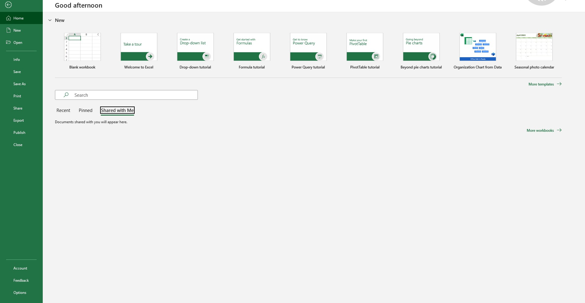
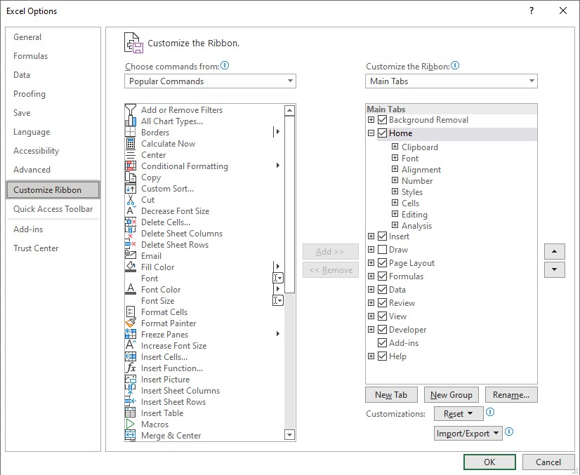
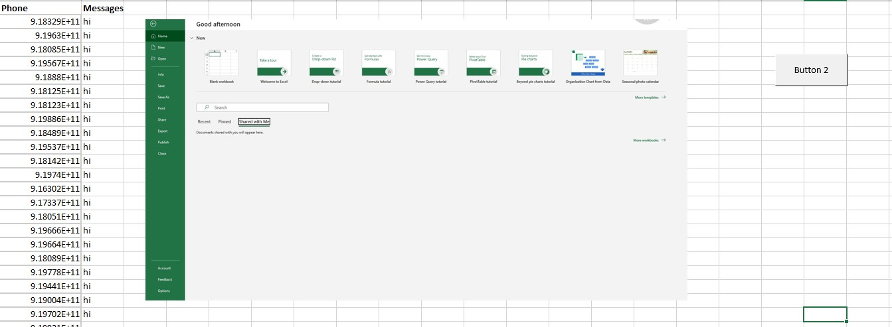

# Whatsapp Bulk Msg Sender Using Excell

I created Simple Whatsapp Bulk Msg Sender Using Excell. Where you can send Msg in bulk level.

Note!!!!
This is only for educational purpose.


<h2>You Should have Whatsapp Desktop on your computer To send the message</h2>


## Instalation

### Step 1

Clone the project.

```bash
  git clone https://github.com/ranjith67/Whatsapp-Bulk-Msg-Sender-Using-Excell.git
```

### Step 2

```bash
  Open the file.
```

### Step 3

Enable Developer tool

```bash
  Click On Options.
```


```bash
  1. Click On Customize Ribbon.
  2. Tick on Developer.
  3. Press Ok.
```


### Step 4

```bash
  1. On Number Field Feed the Mobile Number.
  2. On Message Field Feed the Message.
  3. On Blank Field Paste Img.
```


### Step 5

Run

```bash
  click on button 2
```

