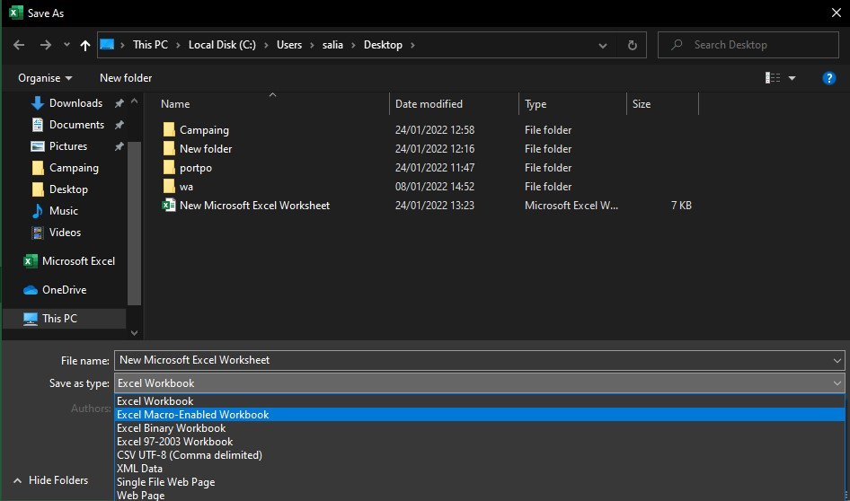

# Whatsapp Bulk Msg Sender Using Excell

I created Simple Whatsapp Bulk Msg Sender Using Excell. Where you can send Msg in bulk level.

Note!!!!
This is only for educational purpose.


## Instalation

### Step 1

Clone the project.

```bash
  git clone https://github.com/ranjith67/Whatsapp-Bulk-Msg-Sender-Using-Excell.git
```

### Step 2

```bash
  Open the file.
```

### Step 3

Enable Developer tool

```bash
  Click On Options.
```


### Step 4

```bash
  Save This Excell file as Excell Macro Enabled Workbook
```


